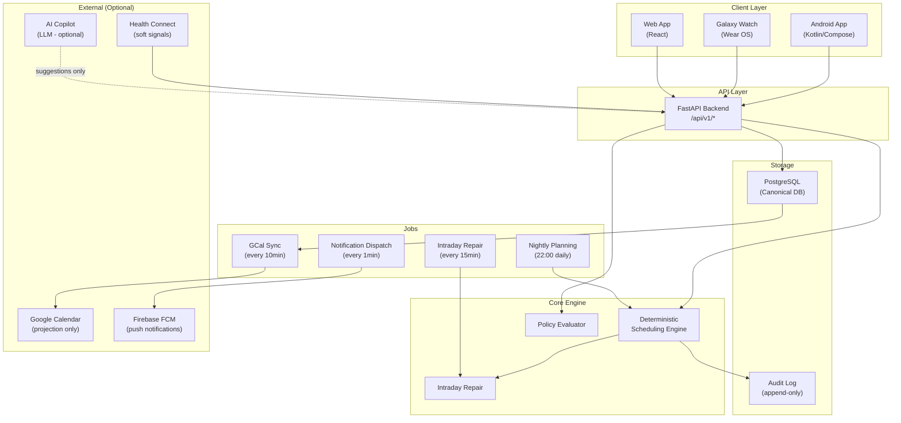
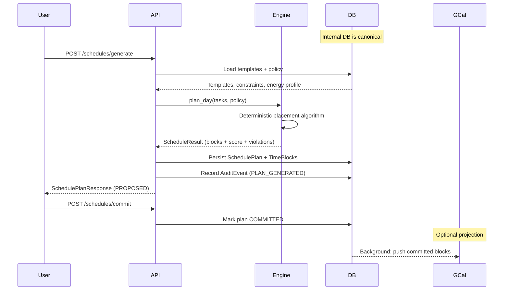

# Life Scheduler — Personal Adaptive Life Scheduler

A **policy-driven, deterministic, adaptive life scheduler** that acts like a life operating system.

> **This is NOT a to-do app and NOT a calendar clone.**
>
> The internal database is the canonical source of truth. Google Calendar is an optional projection layer.
> Every scheduling decision is deterministic, explainable, and auditable. LLMs are optional copilots — never scheduling authorities.

---

## Table of Contents

1. [Product Vision](#product-vision)
2. [Architecture](#architecture)
3. [Domain Model](#domain-model)
4. [Scheduling Engine](#scheduling-engine)
5. [Google Calendar Strategy](#google-calendar-strategy)
6. [API Reference](#api-reference)
7. [Background Jobs](#background-jobs)
8. [Database Schema](#database-schema)
9. [Setup & Running](#setup--running)
10. [Testing](#testing)
11. [MVP Roadmap](#mvp-roadmap)
12. [Brutal Critique](#brutal-critique)

---

## Product Vision

Replace Google Calendar as the scheduling source of truth with a system that:

- **Maintains its own internal canonical schedule** (not Google Calendar)
- **Automatically schedules and reschedules** time blocks based on constraints and policies
- **Supports Android + Galaxy Watch** notification surface
- **Has a web UI** for auditing and editing
- **Optionally syncs** to Google Calendar as a projection target
- **Works without any LLM features** — AI is a copilot, not the kernel

### Critical Philosophy

| Principle | Description |
|-----------|-------------|
| **Deterministic core** | Given the same inputs + policies, the engine always produces the same schedule |
| **Explainability** | Every block placement has a human-readable reason; every change creates an audit event |
| **Hard constraints dominate** | No soft preference ever silently overrides a hard constraint |
| **Low churn** | Freeze horizon protects imminent blocks; committed schedules are moved only when necessary |
| **Canonical DB** | Google Calendar is a read-only display layer. Internal DB owns the truth |
| **LLMs are optional** | The system is fully functional with all AI features disabled |

---

## Architecture



### Scheduling Flow



---

## Domain Model

### Core Entities

| Entity | Description |
|--------|-------------|
| **User** | App user with timezone, auth credentials |
| **CalendarAccount** | Google OAuth tokens for optional GCal sync |
| **Goal** | High-level life goal (e.g. "Learn Korean"). Drives weekly quotas |
| **PolicyProfile** | Named constraint set (e.g. "Strict Coach", "Relaxed Weekend") |
| **Constraint** | Single policy rule: hard (must) or soft (scored penalty) |
| **TaskTemplate** | Reusable task definition with recurrence, preferred windows, scheduling class |
| **TaskInstance** | Concrete occurrence of a task on a specific day, created by planning job |
| **SchedulePlan** | Versioned snapshot of a day's schedule. Starts PROPOSED, becomes COMMITTED |
| **TimeBlock** | A scheduled task in a concrete time slot. The core schedulable unit |
| **ScheduleRevision** | Immutable diff log of every change to a plan (event sourcing) |
| **AuditEvent** | Append-only event log with human-readable explanations for every change |
| **NotificationEvent** | Notification dispatch state (pending/sent/actioned) |
| **RecoveryRule** | Policy for handling missed tasks (reschedule, carry forward, drop) |
| **DomainExpert** | Pluggable module that generates candidate tasks/policies for a domain |
| **ContextSignal** | Health/environment signals (sleep quality, steps, HRV) as soft context |
| **EnergyProfile** | Per-user hourly energy levels, preferred windows, work hours |
| **SyncMapping** | Maps internal TimeBlocks to Google Calendar event IDs |

---

## Scheduling Engine

### Scheduling Classes (Priority Order)

| Class | Description | Example |
|-------|-------------|---------|
| `hard_real_time` | Fixed, never moved | Meetings, medical appointments |
| `fixed_recurring` | Same slot every day/week | Morning workout, language study |
| `deadline_driven` | Must finish before deadline (EDF) | Report due by 15:00 |
| `quota_based` | N hours/week, flexible when | Deep work, reading |
| `opportunistic` | Fill any remaining gap | Low-priority errands |
| `recovery` | Rescheduled missed tasks | Missed workout → afternoon |

### Objective Function

```
score = Σ hard_violations × BIG_M (1e9)
      + Σ soft_violations × weight
      + fragmentation_penalty
      + churn_penalty

Lower score = better schedule.
Hard violations make a plan infeasible (score → ∞).
```

### Nightly Planning Algorithm

```python
def plan_day(target_date, tasks, policy, existing_blocks):
    # 1. Seed with frozen/committed blocks
    placed = freeze_existing_blocks(existing_blocks, policy.freeze_horizon)

    # 2. Sort tasks: scheduling_class priority, then task priority
    sorted_tasks = sort_by_class_then_priority(tasks)

    # 3. Place each task
    for task in sorted_tasks:
        free_slots = compute_free_slots(sched_start, sched_end, placed, min_gap)
        if task.scheduling_class == HARD_REAL_TIME:
            block = place_at_pinned_time(task)
        elif task.scheduling_class == FIXED_RECURRING:
            block = find_best_slot(task, free_slots, preferred_windows=True)
        elif task.scheduling_class == DEADLINE_DRIVEN:
            block = edf_placement(task, free_slots, task.deadline)
        else:  # quota_based, opportunistic, recovery
            block = find_best_slot(task, free_slots, score_by_energy=True)
        placed.append(block) if block else unscheduled.append(task)

    # 4. Evaluate constraints + score
    violations = evaluate_constraints(placed, policy)
    return ScheduleResult(blocks=placed, score=compute_score(violations, placed))
```

### Why Deterministic (Not LLM-led)

| Property | Deterministic Engine | LLM Scheduler |
|----------|---------------------|----------------|
| Consistency | ✅ Same inputs → same output | ❌ Non-deterministic |
| Explainability | ✅ Explicit reason per block | ❌ Black box |
| Hard constraint safety | ✅ Mathematically guaranteed | ❌ May be violated |
| Testability | ✅ Unit testable | ❌ Hard to test |
| Offline operation | ✅ No external dependencies | ❌ Requires API |
| Cost at scale | ✅ Free | ❌ Per-request cost |

---

## Google Calendar Strategy

**Google Calendar is an OPTIONAL projection layer, NOT the source of truth.**

```
Internal DB (canonical)
    ↓  push (one-way)
SyncMapping table (idempotency via sync_hash)
    ↓  push (one-way)
Google Calendar "Life OS" calendar
```

Every `SyncMapping` stores a `sync_hash` (SHA-256 of block content). The sync job skips events where the hash matches. Conflicts always resolve in favour of the internal DB.

---

## API Reference

### Authentication

```http
POST /api/v1/auth/register
POST /api/v1/auth/login        → { "access_token": "eyJ...", "token_type": "bearer" }
GET  /api/v1/auth/me
```

### Schedule Lifecycle

```http
POST /api/v1/schedules/generate   # Create PROPOSED plan
POST /api/v1/schedules/commit     # Commit plan (PROPOSED → COMMITTED)
POST /api/v1/schedules/repair     # Intraday repair for missed tasks
GET  /api/v1/schedules/today      # Today's committed plan
GET  /api/v1/schedules/{plan_id}  # Get specific plan
```

### Tasks & Goals

```http
GET/POST/PATCH/DELETE /api/v1/goals
GET/POST/PATCH/DELETE /api/v1/task-templates
```

### Audit, Notifications, Health, Sync

```http
GET  /api/v1/audit                           # Audit log (filterable by kind)
POST /api/v1/notifications/action            # Handle done/skip/snooze from mobile
POST /api/v1/health/signals                  # Ingest Health Connect signals
POST /api/v1/sync/gcal                       # Push committed blocks to GCal
```

Full interactive docs available at `http://localhost:8000/docs` when running.

---

## Background Jobs

| Job | Schedule | Purpose |
|-----|----------|---------|
| `nightly_planning_job` | Daily 22:00 | Generate tomorrow's proposed plan |
| `intraday_repair_job` | Every 15min | Detect missed blocks, trigger repair |
| `gcal_sync_job` | Every 10min | Push committed blocks to Google Calendar |
| `notification_dispatch_job` | Every 1min | Send due push notifications via FCM |

---

## Setup & Running

### Quick Start with Docker

```bash
git clone https://github.com/Alegruz/Scheduler.git
cd Scheduler
docker-compose up -d
# API: http://localhost:8000
# Docs: http://localhost:8000/docs
```

### Local Development

```bash
cd backend
python -m venv .venv && source .venv/bin/activate
pip install -e ".[dev]"
cp .env.example .env  # edit: set DATABASE_URL, SECRET_KEY
alembic upgrade head
uvicorn app.main:app --reload --port 8000
```

### Key Environment Variables

| Variable | Required | Description |
|----------|----------|-------------|
| `DATABASE_URL` | Yes | PostgreSQL connection string |
| `SECRET_KEY` | Yes | JWT signing key (long random string) |
| `GOOGLE_CLIENT_ID` | No | For GCal sync |
| `FCM_SERVER_KEY` | No | For push notifications |
| `FREEZE_HORIZON_MINUTES` | No | Default: 30 |

---

## Testing

```bash
cd backend
python -m pytest tests/ -v                          # All 52 tests
python -m pytest tests/unit/test_scheduler.py -v   # 34 scheduler unit tests
python -m pytest tests/test_api.py -v               # 18 API tests
python -m pytest tests/ --cov=app                   # With coverage
```

### Scheduler Invariants Tested

- ✅ No overlapping blocks are ever produced
- ✅ Pinned blocks always get their exact time slot
- ✅ Hard constraint violations make plans infeasible
- ✅ Freeze horizon is always respected in repair
- ✅ Same inputs → same schedule (determinism)
- ✅ Higher priority tasks placed in better slots
- ✅ Preferred windows are respected
- ✅ Deadline-driven tasks finish before their deadline

---

## MVP Roadmap

| Phase | Status | Description |
|-------|--------|-------------|
| 0 — Paper design | ✅ Done | PRD, architecture, domain model |
| 1 — Backend MVP | ✅ Done | Scheduling engine, API, DB, jobs, tests |
| 2 — Android App | ⬜ Next | Kotlin/Compose, MVVM, WorkManager, FCM |
| 3 — Web Audit UI | ⬜ | React, schedule viewer, policy editor |
| 4 — Health Adaptation | ⬜ | Health Connect, sleep signals, fatigue |
| 5 — AI Copilot | ⬜ | NL task creation, schedule reviews (optional) |

---

## Brutal Critique

### What Will Likely Fail First

1. **Clock drift in freeze horizon** — server time vs. client time differences cause wrong freeze decisions. Use UTC everywhere; store all datetimes with timezone.

2. **Timezone edge case in nightly planning** — running at 22:00 UTC works differently for users in KST (+9) vs. PST (-8). Need per-user scheduled planning, not global cron.

3. **User trust in auto-scheduler** — the PROPOSED → COMMITTED review step is essential but adds friction. Users will abandon it unless the plans are good from day 1.

4. **Google OAuth token expiry** — refresh tokens expire after 6 months of inactivity. Need proactive re-auth flow.

5. **Android notification fatigue** — too many reminders will cause users to disable them. Start with 2 notifications/day maximum.

### How to De-Risk First

1. **Use the backend API yourself for 1 month** before building Android. Discover missing features cheaply.
2. **Run paper simulation** of your actual schedule against the algorithm to find edge cases.
3. **Ship watch as read-only** in MVP; add interactions later.
4. **Delay AI features** until the deterministic core is trusted and stable.
5. **Add churn metrics from day 1** — track how often blocks get moved. Alert if weekly churn > 20%.

---

## Repository Structure

```
Scheduler/
├── backend/                   # Python/FastAPI backend
│   ├── app/
│   │   ├── api/v1/endpoints/  # auth, goals, schedules, audit, sync, health, notifications
│   │   ├── core/              # Config, JWT security
│   │   ├── db/                # SQLAlchemy models + session
│   │   ├── engine/            # Deterministic scheduling engine ← CORE
│   │   ├── jobs/              # APScheduler background workers
│   │   └── schemas/           # Pydantic v2 schemas
│   ├── alembic/versions/      # Database migrations
│   ├── tests/unit/            # Pure Python scheduler tests
│   ├── tests/test_api.py      # FastAPI integration tests
│   ├── Dockerfile
│   └── pyproject.toml
└── docker-compose.yml
```

*Built with Python 3.11, FastAPI, SQLAlchemy 2, PostgreSQL, APScheduler, Pydantic v2.*
